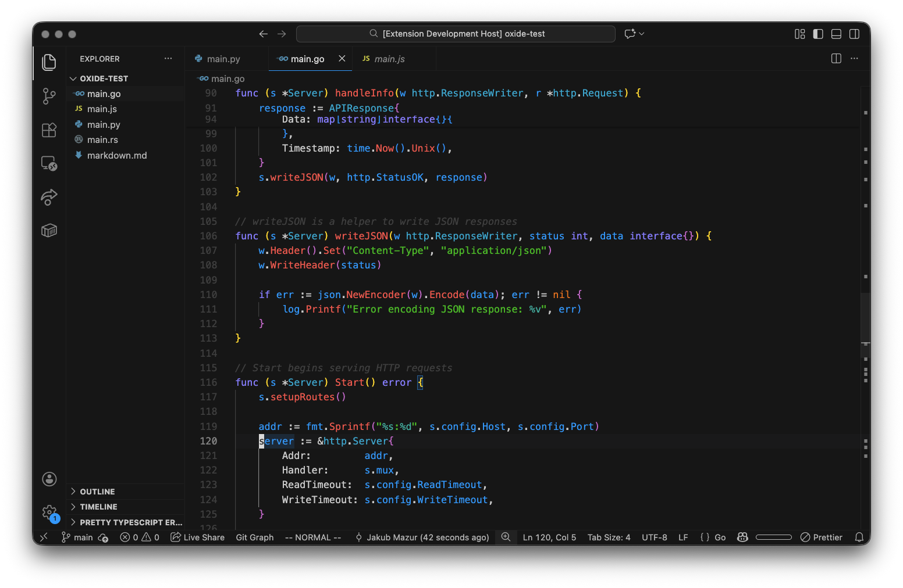

<div align="center">

# oxide for VS Code

</div>

<h6 align="center">
Where function meets form.
</h6>

<p align="center">
  <a href="https://github.com/oxidescheme/vscode/stargazers"></a>
  <a href="https://github.com/oxidescheme/vscode/issues"></a>
  <a href="https://marketplace.visualstudio.com/items?itemName=oxidescheme.oxide-theme"></a>
  <a href="https://discord.gg/p8GcbBH5MR"></a>
</p>

<p align="center">
  
</p>

*oxide* for [VS Code](https://code.visualstudio.com/) brings the oxide colorscheme to your code editor.
A minimalist dark theme built around clarity and restraint, using a deep near-black background, crisp white foregrounds, and vibrant accent colors to emphasize structure without visual noise.

## Design Philosophy

oxide is built on three core principles:

- **Function first**: Every color exists to convey information
- **Visual silence**: Elegance emerges from what is intentionally omitted
- **Systematic harmony**: Every color relates predictably to the others

The full design philosophy and color system are documented in the [main oxide repository](https://github.com/oxidescheme/oxide).

## Installation

### Via VS Code Marketplace (Recommended)

1. Open VS Code
2. Go to Extensions (`Ctrl+Shift+X` / `Cmd+Shift+X`)
3. Search for "Oxide Theme"
4. Click Install
5. Press `Ctrl+Shift+P` / `Cmd+Shift+P`
6. Type "Preferences: Color Theme"
7. Select "Oxide"

### Via Command Line

```bash
code --install-extension oxidescheme.oxide-theme
```

### Manual Installation

1. Download the latest `.vsix` file from [GitHub Releases](https://github.com/oxidescheme/vscode/releases)
2. Open VS Code
3. Go to Extensions view
4. Click "..." (Views and More Actions)
5. Select "Install from VSIX..."
6. Choose the downloaded file

## Features

### Comprehensive Syntax Highlighting

- **Functions**: Red (`#ed756e`) - Clear identification of callable elements
- **Strings**: Green (`#5bb661`) - Distinct text and data representation
- **Keywords**: Purple (`#968ff7`) - Language structure and control flow
- **Variables**: Blue (`#3ba6f5`) - Identifiers and references
- **Types/Classes**: Sky (`#00b3d6`) - Type definitions and structures
- **Constants/Numbers**: Orange (`#e48233`) - Literal values
- **Comments**: Subtle gray (`#484848`) - Intentionally de-emphasized
- **Operators**: Text color (`#cecece`) - Minimal distraction

### Minimalist UI

- Clean gray interface with deep black backgrounds
- Accent colors only where they convey information
- Subtle borders and visual hierarchy
- Focused editing experience without distractions

### Integrated Features

- **Terminal Colors**: Full ANSI color support matching the theme palette
- **Git Integration**: Semantic colors for added, modified, and deleted files
- **Semantic Highlighting**: Enhanced token coloring for supported languages
- **Symbol Icons**: Consistent iconography with theme colors
- **Debug Mode**: Contextual highlighting during debugging sessions

## Configuration

The theme works out of the box with no configuration needed. However, you can customize specific aspects in your `settings.json`:

### Bracket Pair Colorization

VS Code's bracket pair colorization is automatically styled with oxide colors:

```json
{
  "editor.bracketPairColorization.enabled": true
}
```

### Semantic Highlighting

For enhanced token coloring (recommended):

```json
{
  "editor.semanticHighlighting.enabled": true
}
```

## Color Palette

oxide uses a carefully calibrated OKLCH color space palette:

### Base Colors
- **Background**: `#161616` - Deep near-black
- **Foreground**: `#cecece` - Crisp white
- **Subtle Text**: `#bebebe`, `#8f8f8f`, `#484848` - Hierarchical grays

### Accent Colors
- **Red**: `#ed756e` - Errors, functions
- **Orange**: `#e48233` - Warnings, constants
- **Yellow**: `#c39900` - Highlights, search
- **Green**: `#5bb661` - Success, strings
- **Teal**: `#00baaa` - Special elements, imports
- **Sky**: `#00b3d6` - Types, classes
- **Blue**: `#3ba6f5` - Variables, information
- **Purple**: `#968ff7` - Keywords, control flow

## Contributing

We follow the same philosophy as the main oxide project: minimalism doesn't mean stagnation.

- Report issues through [GitHub Issues](https://github.com/oxidescheme/vscode/issues)
- PRs that improve clarity and consistency are welcome
- Ensure changes align with oxide's functional aesthetic

## Credits

- **Port Creator:** [@jakmaz](https://github.com/jakmaz)
- **Current Maintainer:** [@jakmaz](https://github.com/jakmaz)
- **Contributors:** See [contributors list](https://github.com/oxidescheme/vscode/graphs/contributors)

## License

MIT License - see [LICENSE](LICENSE) for details.

<p align="center">
Copyright &copy; 2025-present oxidescheme
</p>
