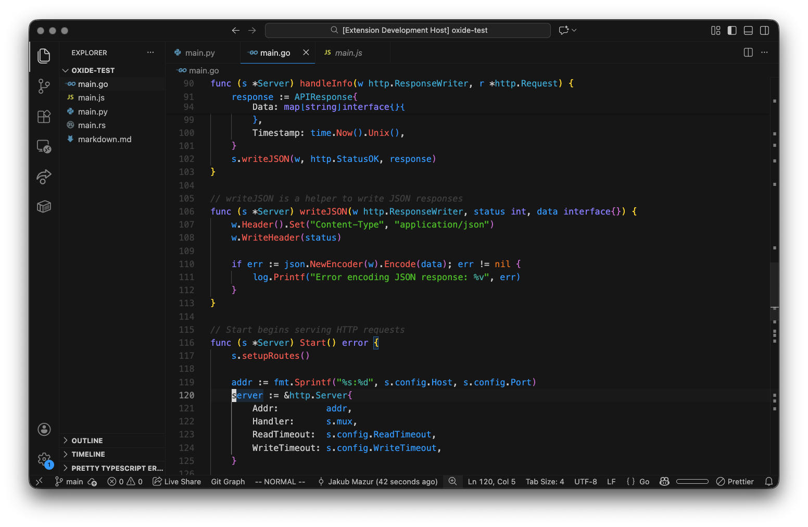

<div align="center">

# oxide for VS Code

</div>

<h6 align="center">
Where function meets form.
</h6>

<p align="center">
  <a href="https://github.com/oxidescheme/vscode/stargazers"></a>
  <a href="https://github.com/oxidescheme/vscode/issues"></a>
  <a href="https://discord.gg/p8GcbBH5MR"></a>
</p>

<p align="center">
  
</p>

oxide for [VS Code](https://code.visualstudio.com/).

## Installation

### Via VS Code Marketplace

1. Open VS Code
2. Go to Extensions (`Ctrl+Shift+X` / `Cmd+Shift+X`)
3. Search for "Oxide Theme"
4. Click Install
5. Press `Ctrl+Shift+P` / `Cmd+Shift+P`
6. Type "Preferences: Color Theme"
7. Select "Oxide"

### Via Command Line

```bash
code --install-extension oxidescheme.oxide-theme
```

## Contributing

PRs welcome. Make sure colors match the palette in the [main repo](https://github.com/oxidescheme/oxide).

## Credits

- **Port Creator:** [@jakmaz](https://github.com/jakmaz)
- **Current Maintainer:** [@jakmaz](https://github.com/jakmaz)
- **Contributors:** See [contributors list](https://github.com/oxidescheme/vscode/graphs/contributors)

## License

MIT License - see [LICENSE](LICENSE) for details.

<p align="center">
Copyright &copy; 2025-present oxidescheme
</p>
